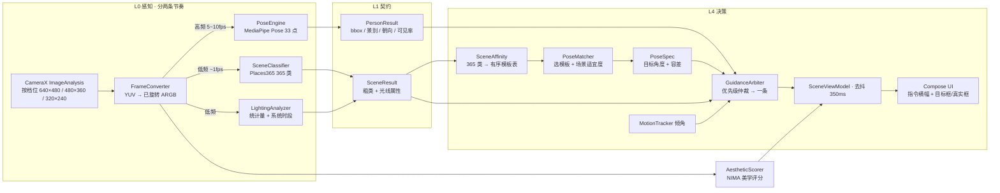

# AiCamera · 场景驱动的拍照姿势助手

> 识别眼前的场景 → 告诉你人该站哪、朝哪、相机举多高 → 照着摆，按快门。

全部推理在手机本地完成，**不联网、不上传任何图片**。

---

## 做这个东西的起因

很多新手机自带"AI 构图"，老机型没有。最初的想法是复刻它：用模型回归出一个最佳构图框，
再用箭头引导用户把镜头挪过去。**做出来能跑，但实际效果不行** —— 框会抖、方向指示不直观，
用户盯着一个不断跳动的框不知道该往哪走。

于是换了个思路，也是最关键的转折：

| | v1 构图引导（已弃） | v2 场景推荐（已弃） | **v3 闭环引导（当前）** |
|---|---|---|---|
| 做什么 | 回归一个构图框让用户去追 | 识别场景 → 给出站位 + 姿势方案 | 识别场景 + 检出人 → **一次只给一条指令** |
| 是否判断人 | 不做姿态估计，但要引导用户移动 | **明确不做**，只判断"景" | 做，MediaPipe Pose 33 点 |
| 输出 | 会抖动的框 + 方向箭头 | 三条姿势卡片并列 | **一条指令 + 目标框/真实框重合度** |
| 稳定性 | 回归任务，帧间易跳 | 分类任务，输出稳定 | 分类 + 确定性几何，均做了去抖 |
| 用户能否照做 | 难，方向感模糊 | 能，但一次给三条等于没给 | 能，"人往左挪一点""左肘再弯一点" |

**核心判断**：与其让 AI 猜一个你看不懂的框，不如让它告诉你一件能照做的事。
场景识别是分类任务，比回归稳得多；而且场景变化慢，**1 秒多识别一次就够**，
高帧率反而不必要 —— 省下来的算力刚好够跑姿态检测。

v2 的失败不在识别，而在输出：同样一个场景，人站哪、什么景别都给一样的答案，
而且三条卡片并列的结果是一条都看不完。v3 因此把人接回闭环，并把输出压到一条。

v1 的代码已从 `app/` 移除，但 Adacrop 模型的导出与验证脚本保留在 `tools/`，
想捡回来可以直接跑（详见文末「如果你想要回 v1」）。

---

## 快速开始

**直接用**：仓库 Actions 每次推 main 会自动出 debug APK，在 Actions 页面下载 `aicamera-debug` 产物即可。
minSdk 24（Android 7.0+），两个 ABI（arm64-v8a / armeabi-v7a）。

**当前 APK 78.2 MB**（v2 是 44.2 MB）。构成实测：

| 部分 | 体积 | 说明 |
|---|---|---|
| 模型与资源 | 35.0 MB | Places365 21.7 + NIMA 6.2 + Pose 5.5 + 标签 + 规格 |
| MediaPipe native | 22.5 MB | arm64 14.0 + armv7 8.5（`libmediapipe_tasks_vision_jni.so`） |
| TFLite native | 5.6 MB | arm64 3.4 + armv7 2.2 |
| 代码与资源 | 其余 | — |

想瘦身最直接的一步是把 `abiFilters` 收成只留 `arm64-v8a`，**立省约 11 MB**，
代价是不再支持 32 位老机型。

**自己构建**：需要 JDK 17（Gradle 8.7 / AGP 8.5.2 / Kotlin 2.0.21）。

```bash
git clone https://github.com/pelico/aicamera.git
cd aicamera
./gradlew assembleDebug        # 产物 app/build/outputs/apk/debug/app-debug.apk
```

模型文件已随仓库提交（34 MB）。若被 Git LFS 或网络策略剥离，可用脚本补下：

```bash
python tools/fetch_models.py    # 4 个模型/资源：Places365、NIMA、标签、pose_landmarker_lite.task
```

CI 配置在 `.github/workflows/build-apk.yml`，内含模型缺失时的兜底下载步骤。
若配置 `KEYSTORE_BASE64` 等 4 个 secret，会额外产出签名 release 包。

---

## 四个页面

**取景推荐** — CameraX 实时预览。场景低频（约 1 fps）识别，姿态高频（5~10 fps）检测。
画面上叠三分线、**虚线目标站位框**（模板给的）和**实线真实人物框 + 骨架**（MediaPipe 检到的），
两框重合就是站位对了；底部一条横幅**一次只显示一条指令**，按优先级挑最该改的那一项。

**姿势库** — 45 条模板按 12 个场景大类浏览，可手动指定一条，切回取景页照着摆。
其中 10 条带角度规格（`pose_specs.json`），只有它们能进"摆到位了"的闭环。

**拍后分析** — 从相册选一张已拍照片，识别场景 + 美学评分 + 人物景别/朝向，
并回答"如果重拍这张，最该改的是哪一条"。

**性能实测** — 在当前机器上真跑三个模型，给出实际单帧延迟、设备档位与调度节奏；
另有「复制当前角度」按钮，用于给 `pose_specs.json` 采样校准。
桌面 CPU 的数据只能作数量级参考，**真机请用这一页**。

---

## 架构



两条节奏是这版性能上的关键：场景慢（省电），姿态快（跟手），**共用同一帧、只做一次 YUV 转换**。
入门机（核少 / 内存小）直接关掉姿态层，保留场景 + 参考线 + 站位框这些零成本的部分。

## 技术栈

| 层 | 用什么 |
|---|---|
| 取景 | CameraX 1.3.4（Preview + ImageAnalysis + ImageCapture） |
| 场景识别 | Places365-ResNet18，TFLite fp16，365 类，21.7 MB |
| 姿态检测 | MediaPipe Pose Landmarker **lite**，IMAGE 模式，33 点，5.5 MB |
| 光线判断 | **无模型**：亮度、对比度、上下/左右亮度差、高光占比 + 系统时段 |
| 姿势匹配 | 亲和表有序名次 6.0/4.5/3.0/1.5 × 概率（top-5 衰减叠加）+ 时段 0.6 + 光线 0.5 + 有闭环规格 0.8 |
| 场景适宜度 | 365 类里 33 类判为不宜拍人像（浴室/机房/垃圾场…）、11 类需挑角度 |
| 关节特征 | 9 个可测量量：双臂抬起 / 双肘 / 双膝夹角、躯干倾斜、两脚张开、脸的转向 |
| 指令仲裁 | 优先级 场景不宜 5 → 没检到人 10 → 遮挡 20 → 水平 30 → 景别 40 → 站位 50/52 → 姿势 60 → 多人 75 → 需挑角度 90 → 就绪 100 |
| 剪影渲染 | Compose Canvas 纯矢量绘制，**零图片资源** |
| 水平仪 | 陀螺仪/旋转向量的 roll 角 |
| UI | Jetpack Compose + Material 3 |
| 设备自适应 | 按 CPU 核数 + 内存分 3 档，档位决定：场景间隔 / 姿态间隔 / 分析帧分辨率 / 是否开姿态 |

## 模型资产

| 模型 | 来源 | 协议 | 体积 |
|---|---|---|---|
| Places365-ResNet18 | [CSAILVision/places365](https://github.com/CSAILVision/places365) via [litert-community](https://huggingface.co/litert-community/Places365-ResNet18-LiteRT) | MIT | 21.7 MB |
| NIMA 美学评分 | [litert-community/NIMA-LiteRT](https://huggingface.co/litert-community/NIMA-LiteRT) | Apache-2.0 | 6.2 MB |
| Pose Landmarker lite | [Google MediaPipe](https://storage.googleapis.com/mediapipe-models/pose_landmarker/pose_landmarker_lite/float16/1/pose_landmarker_lite.task) | Apache-2.0 | 5.5 MB |

场景与美学模型都是 tflite，统一走 TFLite 运行时 —— v1 的 ONNX Runtime 已经去掉，
仅此一项就让 APK 从 59.5 MB 降到 44.2 MB。姿态层用 `.task`（MediaPipe 自有的 bundle 格式），
不受这个改动影响，但**会带入两个 ABI 的 native 库**。

**参考性能**（桌面 CPU，仅供估计数量级）：Places365 86.8 ms/帧、NIMA 29.0 ms/帧。
手机端走 XNNPACK 多线程应显著更快；姿态检测的实际耗时请用 App 内「性能实测」页在真机上看。

---

## 推荐是怎么算出来的（以及中间为什么重写过一次）

v3 第一版上线后反馈是「场景识别能工作，但拍摄建议不理想」。把打分逻辑在
`tools/diag_match.py` 里用 Python 复刻一遍、跑遍 365 个场景标签，结果是：

| 指标 | v3 首版 | 现在 |
|---|---|---|
| 首条推荐存在**同分并列**的场景 | 271 / 365（74%） | **0** |
| 能被模板 tag 命中的标签 | 133 / 365（36%） | — |
| 首条推荐等于亲和表首选 | — | **365 / 365** |

同分并列意味着推荐不由场景决定，而是 Kotlin 稳定排序下「模板在 `PoseLibrary.ALL`
里排第几条」。加上 `SHOP` 一个分组塞了 112 个标签（办公室 / 卧室 / 商场 / 电梯 / 展馆）
却只有 4 条咖啡馆模板，于是**在办公室举起手机，它给你推「书架间回眸」**。
更糟的是时段 +1.2、光线 +1.0 的权重大于分组命中的 1.5×概率 ≈ 0.6，
「现在几点」比「你在哪」更能决定推荐什么。

改法是三件事一起做：

1. **补内容**，模板 44 → 57 条，新增「室内 · 日常」一大组（沙发 / 窗边 / 桌前 /
   床边 / 展墙 / 中庭 / 楼梯 / 餐桌 / 大堂 / 走廊 / 货架过道），外加玻璃幕墙与天台夜景。
2. **显式亲和表** `assets/scene_affinity.json`：365 个标签各有一份排好序的模板 id 列表，
   由 `tools/gen_affinity.py` 生成（手工覆盖 99 / 关键词规则 99 / tag 命中 86 / 分组兜底 81）。
   同分并列从根上消失。**改完 `PoseTemplate.kt` 要重新生成一次**。
3. **重写打分**：主分来自亲和表名次，时段/光线降到 0.6 / 0.5 只做微调，
   并把人数与当前景别纳入——已经怼脸特写了还推全身模板没意义。

另外加了 `SceneUsability`：**33 个场景标签判为不宜拍人像**（浴室、更衣室、机房、
垃圾场、电梯井…），这些地方不再硬凑姿势，直接说"换个地方"。
在洗手间里给拍照建议比不给更糟。

## 实现中踩过的坑

这几个都是不看源码会白花很久排查的点：

**Places365 要做 ImageNet 归一化，Adacrop 只做 /255。** 两个模型预处理不一致，
混用会让分类结果完全错乱。归一化参数写死在 `SceneClassifier`。

**YUV 帧必须按 `imageInfo.rotationDegrees` 旋转后再判断光线。** 不旋转的话竖屏时
"天空在上"这个前提就是反的，逆光判断全部失效。

**Places365 是国外数据集，国内场景会落到近似标签。** 古镇会被判成 `courtyard`、
油菜花田判成 `field/cultivated`。用 `SceneLabels.localHint` 给出针对性解释，
`PoseMatcher` 的分组兜底保证任何场景都有建议。

**分组关键词规则要注意顺序。** `orchard` 必须先于 `arch` 命中，否则全部落到"建筑"组。

**TFLite Interpreter 不是线程安全的。** 相机分析线程和性能实测页可能并发调用，
所有模型调用统一用 `modelLock` 串行化。

**CameraX 的 `setSurfaceProvider` 是 Java setter，无 getter 配对。**
Kotlin 里必须写 `it.setSurfaceProvider(...)`，属性赋值语法会报 Unresolved reference。

**MediaPipe 的帧只能旋转一次。** `FrameConverter` 已经把 YUV 转到屏幕正立方向，
PoseEngine 用 IMAGE 模式就**不能再传 rotationDegrees**，否则转两次、左右全反。

**`.task` 必须加进 `noCompress`。** 压缩过的模型从 assets 加载会直接失败，
而且失败信息不一定指向真正的原因。`.tflite` 同理。

**`visibility()` 返回的是 `Optional<Float>`，不是 `float`。** 而且 minSdk 24 上
`java.util.Optional` 是 API 26 才有的类 —— 要用到它必须开 `coreLibraryDesugaring`，
否则 Android 7 上直接 `NoClassDefFoundError`。取不到可见度时退回 1f，不让"遮挡"误报。

**叠加层必须画在"预览可见矩形"里，不是全屏。** ImageAnalysis 是 4:3，PreviewView 是全屏
FIT_CENTER，两者坐标系不同；高瘦屏上直接用全屏尺寸画，目标框会整体偏出画面。
`util/ViewportMapper` 就是干这个的。

**45 条模板 ≠ 45 条能进闭环。** 只有带 `pose_specs.json` 角度目标的 10 条能判"摆到位了"，
其余只给站位与朝向参考 —— 硬凑数值等于编数据。

---

## 目录结构

```
app/src/main/java/com/pelico/aicamera/
├── contract/Perception.kt     L0 契约：SceneResult / PersonResult / Guidance
├── SceneViewModel.kt          状态中枢 + 双节奏调度 + 指令去抖
├── engine/
│   ├── SceneClassifier.kt     Places365 tflite 推理
│   ├── SceneLabels.kt         365 类中文名 + 场景分组 + 本土化提示
│   ├── LightingAnalyzer.kt    时段与光线判断（无模型）
│   ├── PoseEngine.kt          L1 姿态层：MediaPipe Pose → PersonResult
│   ├── PoseAngles.kt          33 点 → 9 个关节特征 + 人话文案
│   ├── PoseTemplate.kt        模板数据模型 + 57 条模板
│   ├── PoseSpec.kt            pose_specs.json 解析 + 角度差匹配
│   ├── SceneAffinity.kt       365 类 → 有序模板表 + 场景适宜度
│   ├── PoseMatcher.kt         场景 → 模板的匹配打分（亲和表优先 + 画面上下文）
│   ├── GuidanceArbiter.kt     L4 仲裁：多偏差 → 一条指令
│   ├── AestheticScorer.kt     NIMA 美学评分
│   ├── MotionTracker.kt       陀螺仪 + 水平仪
│   └── DeviceTier.kt          设备档位 → RuntimePolicy（真正接线）
├── ui/
│   ├── MainScreen.kt          权限 + 四个 Tab
│   ├── CameraScreen.kt        取景与引导
│   ├── PoseFigure.kt          剪影 + 叠加层（目标框/真实框/骨架）
│   ├── GuidanceBanner.kt      单指令横幅
│   ├── PoseCard.kt            姿势卡片
│   ├── PoseLibraryScreen.kt   姿势库浏览
│   ├── AnalyzeScreen.kt       拍后分析
│   ├── BenchmarkScreen.kt     性能实测 + 角度采样
│   └── theme/Theme.kt
└── util/
    ├── FrameConverter.kt      YUV → 已旋转 ARGB
    ├── ViewportMapper.kt      分析帧 → 预览可见矩形
    └── ImageSaver.kt          保存到相册

app/src/main/assets/
├── places_fp16.tflite         场景分类
├── nima_aesthetic_fp16.tflite 美学评分
├── pose_landmarker_lite.task  姿态检测
├── categories_places365.txt   365 类标签
├── scene_affinity.json        365 类 → 有序模板 + 不宜拍的场景
└── pose_specs.json            10 条模板的角度目标（verified=false）

tools/                         离线工具（不参与 APK 构建）
├── fetch_models.py            补下缺失的模型文件
├── gen_affinity.py            重新生成 scene_affinity.json
├── diag_match.py              推荐链路诊断（同分并列 / 覆盖率）
├── eval_scene.py              场景粗类评测（见 docs/EVALUATION.md）
├── export_onnx.py             [v1] Adacrop → 单文件 ONNX 导出
├── verify_*.py               模型验证脚本
└── models/common.py           [v1] MobileNetPolicy 结构定义
```

工程规模：Kotlin 约 3,800 行，其中姿势模板库独占约 1,000 行 ——
**这个项目的成本主要在内容，不在代码。**

---

## 已知局限

**第三方案件拿不到系统相机的画质。** CameraX 走公开的 Camera2 能力，用不了厂商私有影像算法
（夜景、HDR、人像虚化、色彩调校）。同一颗镜头，本 App 出片大概率不如系统相机。
若更在意画质，可把本 App 当"构图教练"用：看完建议，切回系统相机拍。

**Places365 没有国内特色场景的原生类别。** 目前靠分组兜底 + 本土化文案近似处理。
要做到准，需要自建本土场景分类（工作量大一个量级）。

**剪影的可读性还没经过真机验证。** 剪影是参数化矢量绘制，缩放不失真，
但小屏幕上"朝向"指示是否一眼看懂，需要实际使用反馈。

**`pose_specs.json` 里的角度全部 `verified = false`。** 那 10 条的目标角度是
按几何关系推的初值，不是从真人采样统计出来的。App 内置「复制当前角度」入口：
摆好 → 复制 → 贴回 JSON → 把 `verified` 翻成 true。在翻之前，
这些数值只表示"可以试"，不表示"已经准"。

**背面朝向测不出来，所以不判。** MediaPipe Pose 输出的是朝 -Z 的骨架，
正面和背面在 2D 投影上长得一样。`PersonResult.facing` 只可能是 FRONT / SIDE_45 / SIDE_90，
背身类的模板（`BACK` / `LOOK_BACK`）在加载 spec 时就被过滤掉，不进角度闭环。
不做假判断比给一个错判断有用。

**遮挡判断依赖关键点的 visibility。** 拿不到可见度时退回"有没有出画"，
此时被物体挡住（人站在柱子后面）是测不出来的。

## 后续可以做的

- [ ] **把 10 条 spec 采样校准到 verified=true**（App 内已有采样入口，缺的是人去摆）
- [ ] 评测集落地：`tools/eval_scene.py` 已就绪，`docs/EVALUATION.md` 写了怎么凑 100~150 张
- [ ] 只打 arm64-v8a，APK 明显变瘦（代价是不支持 32 位老机型）
- [ ] 收集国内特色场景样本，微调一个小分类器替换 Places365 的近似结果
- [ ] 加推荐去重：同一场景连续出现时轮换不同姿势，不要总推同一条
- [ ] 对齐到一定程度时自动触发快门（指令为 READY 且稳定 1 秒）

## 如果你想要回 v1

v1 的 Adacrop 构图模型已经跑通并验证过：

```bash
pip install torch torchvision onnx onnxruntime ai-edge-litert pillow
# 权重来自 hf-mirror.com/LiveCompose/Adacrop-MNV3-Distilled
python tools/export_onnx.py --quant    # 产出单文件 ONNX（会自动内联外部权重）
python tools/verify_adacrop.py         # 端到端核对，含 PyTorch vs ORT 数值对齐
```

已知结论：int8 量化体积省 3 MB，但**推理慢 12 倍**（ORT 对 depthwise 卷积优化很差），
移动端别用；训练时只做 /255、**没有** ImageNet 归一化，这点务必注意。

---

## 版权与致谢

姿势模板的内容是手工整理的通用摄影经验，不是从任何受版权保护的图库抓取的；
人形剪影为纯矢量绘制，不含第三方图片素材。

模型来自 CSAILVision / litert-community，遵循各自协议（见上表）。
**仓库代码尚未选择开源协议** —— 若希望他人可自由使用，建议补一个 MIT LICENSE。
