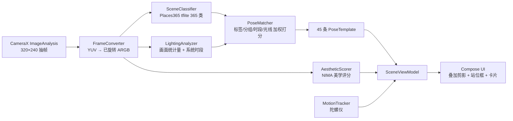

# AiCamera · 场景驱动的拍照姿势助手

> 识别眼前的场景 → 告诉你人该站哪、朝哪、相机举多高 → 照着摆，按快门。

全部推理在手机本地完成，**不联网、不上传任何图片**。

---

## 做这个东西的起因

很多新手机自带"AI 构图"，老机型没有。最初的想法是复刻它：用模型回归出一个最佳构图框，
再用箭头引导用户把镜头挪过去。**做出来能跑，但实际效果不行** —— 框会抖、方向指示不直观，
用户盯着一个不断跳动的框不知道该往哪走。

于是换了个思路，也是最关键的转折：

| | v1 构图引导（已弃） | v2 场景驱动的姿势推荐（当前） |
|---|---|---|
| 做什么 | 回归一个构图框让用户去追 | 识别场景 → 给出站位 + 姿势方案 |
| 是否判断人 | 不做姿态估计，但要引导用户移动 | **明确不做**，只判断"景" |
| 输出 | 会抖动的框 + 方向箭头 | 确定性的几何 + 文字要点 |
| 稳定性 | 回归任务，帧间易跳 | 分类任务，输出稳定 |
| 用户能否照做 | 难，方向感模糊 | 能，"侧身 45°、相机压到腰高" |

**核心判断**：与其让 AI 猜一个你看不懂的框，不如让它告诉你一件能照做的事。
场景识别是分类任务，比回归稳得多；而且场景变化很慢，**1.5 秒识别一次就够**，
高帧率反而不必要 —— 性能压力一下子消失了。

v1 的代码已从 `app/` 移除，但 Adacrop 模型的导出与验证脚本保留在 `tools/`，
想捡回来可以直接跑（详见文末「如果你想要回 v1」）。

---

## 快速开始

**直接用**：仓库 Actions 每次推 main 会自动出 debug APK，在 Actions 页面下载 `aicamera-debug` 产物即可。
APK 约 **44 MB**，minSdk 24（Android 7.0+），两个 ABI（arm64-v8a / armeabi-v7a）。

**自己构建**：需要 JDK 17（Gradle 8.7 / AGP 8.5.2 / Kotlin 2.0.21）。

```bash
git clone https://github.com/pelico/aicamera.git
cd aicamera
./gradlew assembleDebug        # 产物 app/build/outputs/apk/debug/app-debug.apk
```

模型文件已随仓库提交（27.9 MB）。若被 Git LFS 或网络策略剥离，可用脚本补下：

```bash
python tools/fetch_models.py    # 下载 places_fp16.tflite / nima_aesthetic_fp16.tflite / 标签文件
```

CI 配置在 `.github/workflows/build-apk.yml`，内含模型缺失时的兜底下载步骤。
若配置 `KEYSTORE_BASE64` 等 4 个 secret，会额外产出签名 release 包。

---

## 四个页面

**取景推荐** — CameraX 实时预览，每 1.5 秒识别一次场景。画面叠加三分参考线、站位虚线框、
矢量人形剪影和水平仪；下方卡片给出当前场景最匹配的姿势（朝向、机位、分步动作、要点），
可左右切换 Top 3，对齐后按快门。

**姿势库** — 45 条模板按 12 个场景大类浏览，可手动指定一条，切回取景页照着摆。

**拍后分析** — 从相册选一张已拍照片，识别场景 + 美学评分，并回答"下次在这儿该怎么拍"。

**性能实测** — 在当前机器上真跑两个模型若干次，给出实际单帧延迟与设备档位。
桌面 CPU 的数据只能作数量级参考，**真机请用这一页**。

---

## 架构



推理链路很短：**每 1.5 秒一次前向推理**，其余时间只做贴图绘制，所以基本不发热。

## 技术栈

| 层 | 用什么 |
|---|---|
| 取景 | CameraX 1.3.4（Preview + ImageAnalysis + ImageCapture） |
| 场景识别 | Places365-ResNet18，LiteRT fp16，365 类，21.7 MB |
| 光线判断 | **无模型**：亮度、对比度、上下/左右亮度差、高光占比 + 系统时段 |
| 姿势匹配 | 标签精确命中 4.0×概率 + 片段命中 2.0× + 分组兜底 1.5× + 时段 1.2× + 光线 1.0× |
| 剪影渲染 | Compose Canvas 纯矢量绘制，**零图片资源** |
| 水平仪 | 陀螺仪/旋转向量的 roll 角 |
| UI | Jetpack Compose + Material 3 |
| 设备自适应 | 按 CPU 核心数 + 内存分 3 档（10 / 5 / 3 fps） |

## 模型资产

| 模型 | 来源 | 协议 | 体积 |
|---|---|---|---|
| Places365-ResNet18 | [CSAILVision/places365](https://github.com/CSAILVision/places365) via [litert-community](https://huggingface.co/litert-community/Places365-ResNet18-LiteRT) | CC BY | 21.7 MB |
| NIMA 美学评分 | [litert-community/NIMA-LiteRT](https://huggingface.co/litert-community/NIMA-LiteRT) | Apache-2.0 | 6.2 MB |

两个模型都是 tflite，统一走 TFLite 运行时 —— 上一版的 ONNX Runtime 已经去掉，
仅此一项就让 APK 从 59.5 MB 降到 44.2 MB。

**参考性能**（桌面 CPU，仅供估计数量级）：Places365 86.8 ms/帧、NIMA 29.0 ms/帧。
手机端走 XNNPACK 多线程应显著更快，且场景识别本来就不需要高频。

---

## 实现中踩过的坑

这几个都是不看源码会白花很久排查的点：

**Places365 要做 ImageNet 归一化，Adacrop 只做 /255。** 两个模型预处理不一致，
混用会让分类结果完全错乱。归一化参数写死在 `SceneClassifier`。

**YUV 帧必须按 `imageInfo.rotationDegrees` 旋转后再判断光线。** 不旋转的话竖屏时
"天空在上"这个前提就是反的，逆光判断全部失效。

**Places365 是国外数据集，国内场景会落到近似标签。** 古镇会被判成 `courtyard`、
油菜花田判成 `field/cultivated`。用 `SceneLabels.localHint` 给出针对性解释，
`PoseMatcher` 的分组兜底保证任何场景都有建议。

**分组关键词规则要注意顺序。** `orchard` 必须先于 `arch` 命中，否则全部落到"建筑"组。

**TFLite Interpreter 不是线程安全的。** 相机分析线程和性能实测页可能并发调用，
所有模型调用统一用 `modelLock` 串行化。

**CameraX 的 `setSurfaceProvider` 是 Java setter，无 getter 配对。**
Kotlin 里必须写 `it.setSurfaceProvider(...)`，属性赋值语法会报 Unresolved reference。

---

## 目录结构

```
app/src/main/java/com/pelico/aicamera/
├── SceneViewModel.kt          场景 / 光线 / 姿势的状态中枢
├── engine/
│   ├── SceneClassifier.kt     Places365 tflite 推理
│   ├── SceneLabels.kt         365 类中文名 + 场景分组 + 本土化提示
│   ├── LightingAnalyzer.kt    时段与光线判断（无模型）
│   ├── PoseTemplate.kt        姿势模板数据模型 + 45 条模板
│   ├── PoseMatcher.kt         场景 → 模板的匹配打分
│   ├── AestheticScorer.kt     NIMA 美学评分
│   ├── MotionTracker.kt       陀螺仪 + 水平仪
│   └── DeviceTier.kt          设备档位探测
├── ui/
│   ├── MainScreen.kt          权限 + 四个 Tab
│   ├── CameraScreen.kt        取景与引导
│   ├── PoseFigure.kt          剪影绘制 + 叠加层
│   ├── PoseCard.kt            姿势卡片
│   ├── PoseLibraryScreen.kt   姿势库浏览
│   ├── AnalyzeScreen.kt       拍后分析
│   ├── BenchmarkScreen.kt     性能实测
│   └── theme/Theme.kt
└── util/
    ├── FrameConverter.kt      YUV → 已旋转 ARGB
    └── ImageSaver.kt          保存到相册

tools/                         离线模型工具（不参与 APK 构建）
├── fetch_models.py            补下缺失的模型文件
├── export_onnx.py             [v1] Adacrop → 单文件 ONNX 导出
├── verify_*.py               模型验证脚本
└── models/common.py           [v1] MobileNetPolicy 结构定义
```

工程规模：Kotlin 约 3,085 行，其中姿势模板库独占 807 行 ——
**这个项目的成本主要在内容，不在代码。**

---

## 已知局限

**第三方案件拿不到系统相机的画质。** CameraX 走公开的 Camera2 能力，用不了厂商私有影像算法
（夜景、HDR、人像虚化、色彩调校）。同一颗镜头，本 App 出片大概率不如系统相机。
若更在意画质，可把本 App 当"构图教练"用：看完建议，切回系统相机拍。

**Places365 没有国内特色场景的原生类别。** 目前靠分组兜底 + 本土化文案近似处理。
要做到准，需要自建本土场景分类（工作量大一个量级）。

**剪影的可读性还没经过真机验证。** 剪影是参数化矢量绘制，缩放不失真，
但小屏幕上"朝向"指示是否一眼看懂，需要实际使用反馈。

## 后续可以做的

- [ ] 只打 arm64-v8a，APK 再瘦约 5 MB
- [ ] 收集国内特色场景样本，微调一个小分类器替换 Places365 的近似结果
- [ ] 加推荐去重：同一场景连续出现时轮换不同姿势，不要总推同一条
- [ ] 姿势模板按用户实际反馈迭代（目前是人工整理的通用摄影经验）
- [ ] 对齐识别到一定程度时自动触发快门

## 如果你想要回 v1

v1 的 Adacrop 构图模型已经跑通并验证过：

```bash
pip install torch torchvision onnx onnxruntime ai-edge-litert pillow
# 权重来自 hf-mirror.com/LiveCompose/Adacrop-MNV3-Distilled
python tools/export_onnx.py --quant    # 产出单文件 ONNX（会自动内联外部权重）
python tools/verify_adacrop.py         # 端到端核对，含 PyTorch vs ORT 数值对齐
```

已知结论：int8 量化体积省 3 MB，但**推理慢 12 倍**（ORT 对 depthwise 卷积优化很差），
移动端别用；训练时只做 /255、**没有** ImageNet 归一化，这点务必注意。

---

## 版权与致谢

姿势模板的内容是手工整理的通用摄影经验，不是从任何受版权保护的图库抓取的；
人形剪影为纯矢量绘制，不含第三方图片素材。

模型来自 CSAILVision / litert-community，遵循各自协议（见上表）。
**仓库代码尚未选择开源协议** —— 若希望他人可自由使用，建议补一个 MIT LICENSE。
